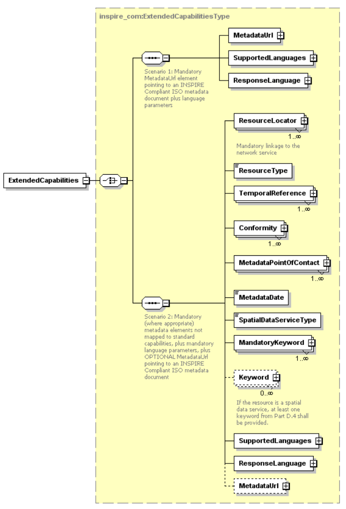

# Conformance class: INSPIRE Profile of WMS 1.3.0 / ISO 19128

The INSPIRE Profile of ISO 19128 conformance class is defined in the [Technical Guidance for the implementation of INSPIRE View Services](#ref_TG_VS) and it is part of the [Abstract Test Suite for the INSPIRE View Services Technical Guidance](http://inspire.ec.europa.eu/id/ats/view-service).

## Standardization target type

OGC web service (WMS 1.3.0)

## Dependencies

### Direct dependencies

A direct dependency is another conformance class whose requirements must be met by the view service, too.

| Specification | Conformance class | Parameters | 
| ------------- | ----------------- | ---------- |
| [ISO 19128 / OGC WMS 1.3.0](#ref_WMS) | Basic WMS | n/a |
 
## External document references

| Abbreviation | Document name                       |
| ------------ | ----------------------------------- |
| INSPIRE  | [Directive 2007/2/EC of the European Parliament and of the Council of 14 March 2007 establishing an Infrastructure for Spatial Information in the European Community (INSPIRE)](http://eur-lex.europa.eu/legal-content/EN/TXT/PDF/?uri=CELEX:32007L0002&from=EN)
| TG VS    | [Technical Guidance for the implementation of INSPIRE View Services](https://inspire.ec.europa.eu/documents/technical-guidance-implementation-inspire-view-services-1)
| IR NS    | [Commission Regulation (EC) No 976/2009 of 19 October 2009 implementing Directive 2007/2/EC of the European Parliament and of the Council as regards the Network Services](http://eur-lex.europa.eu/legal-content/EN/TXT/PDF/?uri=CELEX:32009R0976&from=EN)
| IR MD    | [COMMISSION REGULATION (EC) No 1205/2008 of 3 December 2008 implementing Directive 2007/2/EC of the European Parliament and of the Council as regards metadata](http://eur-lex.europa.eu/LexUriServ/LexUriServ.do?uri=OJ:L:2008:326:0012:0030:EN:PDF)
| TG MD  | [INSPIRE Metadata Implementing Rules: Technical Guidelines based on EN ISO 19115 and EN ISO 19119](https://inspire.ec.europa.eu/id/document/tg/metadata-iso19139)
| IR IOP  | [COMMISSION REGULATION (EU) No 1089/2010 of 23 November 2010 implementing Directive 2007/2/EC of the European Parliament and of the Council as regards interoperability of spatial data sets and services](https://eur-lex.europa.eu/eli/reg/2010/1089/oj)   [COMMISSION REGULATION (EU) No 1253/2013 of 21 October 2013 amending Regulation (EU) No 1089/2010 implementing Directive 2007/2/EC as regards interoperability of spatial data sets and services](http://data.europa.eu/eli/reg/2013/1253/oj)
| WMS      | [OpenGIS Web Map Service (WMS) Implementation Specification, version 1.3.0](http://portal.opengeospatial.org/files/?artifact_id=14416)
| INS MD  | [COMMISSION REGULATION (EC) No 1205/2008 of 3 December 2008 implementing Directive 2007/2/EC of the European Parliament and of the Council as regards metadata](https://eur-lex.europa.eu/legal-content/EN/TXT/PDF/?uri=CELEX:32008R1205&qid=1537886135721&from=EN)

## TG Requirement coverage

Based on requirement numbering in [TG VS](#ref_TG_VS).

| Req#   | Description                          | Covered by test(s)                 | 
| ------ | ------------------------------------ | ---------------------------------- | 
| 1      | Scoping: ISO 19128 + INSPIRE ext.    | n/a                                |
| 2      | WMS basic conformance class          | OGC WMS 1.3.0. A.1.2 Basic WMS Server |
| 3      | GetCapabilities, GetMap              | OGC WMS 1.3.0. "WMS basic" CC ATS  |
| 4      | XML schema validation | [at04-getcapabilities-xml-schema-validation](./at04-getcapabilities-xml-schema-validation.md) |
| 5      | GetCapabilities request parameters | [at05-getcapabilities-get-capabilities-request-parameter](./at05-getcapabilities-get-capabilities-request-parameter.md) |
| 6 (1)  | Scenario 1 - MetadataURL references INSPIRE service metadata | [at06_1-getcapabilities-scenario1-inspire-service-metadata](./at06_1-getcapabilities-scenario1-inspire-service-metadata.md) |
| 6 (2)  | Scenario 2 - Mapping of service metadata elements | [at06_2-getcapabilities-scenario2-mapping-of-all-service-metadata-elements](./at06_2-getcapabilities-scenario2-mapping-of-all-service-metadata-elements.md) |
| 6 (3)  | Scenario 3 - Mapping of service metadata elements to the capabilities section | [at06_3-getcapabilities-scenario3-mapping-of-some-service-metadata-elements](./at06_3-getcapabilities-scenario3-mapping-of-some-service-metadata-elements.md) |
| 8      | Language section in Extended Capabilities | [at08-getcapabilities-language-section-in-extended-capabilities](./at08-getcapabilities-language-section-in-extended-capabilities.md) |
| 30     | GetCapabilities Operation Metadata | [at30-getcapabilities-getcapabilities-operation-metadata](./at30-getcapabilities-getcapabilities-operation-metadata.md) |
| 31     | GetMap Operation Metadata | [at31-getcapabilities-get-map-operation-metadata](./at31-getcapabilities-get-map-operation-metadata.md) |
| 32     | Layers Metadata | [at32-getcapabilities-layers-metadata](./at32-getcapabilities-layers-metadata.md) |
| 33     | Layer Title | [at33-getcapabilities-layer-title](./at33-getcapabilities-layer-title.md) |
| 34     | Layer Abstract | [at34-getcapabilities-layer-abstract](./at34-getcapabilities-layer-abstract.md) |
| 35     | Layer Keyword | [at35-getcapabilities-layer-keyword](./at35-getcapabilities-layer-keyword.md) |
| 36     | Layer Geographic Bounding Box | [at36-getcapabilities-layer-bounding-box](./at36-getcapabilities-layer-bounding-box.md) |
| 37     | Layer Unique Resource Identifier | [at37-getcapabilities-layer-unique-resource-identifier](./at37-getcapabilities-layer-unique-resource-identifier.md) |
| 38     | Layer Authority URL | [at38-getcapabilities-layer-authority-url](./at38-getcapabilities-layer-authority-url.md) |
| 39     | Layer Name | [at39-getcapabilities-layer-name](./at39-getcapabilities-layer-name.md) |
| 39 bis | Harmonised Layer Name | [at39bis-getcapabilities-harmonised-layer-name](./at39bis-getcapabilities-harmonised-layer-name.md) |
| 40     | Layer Coordinate Reference System | [at40-getcapabilities-layer-crs](./at40-getcapabilities-layer-crs.md) |
| 41     | Layer Style | [at41-getcapabilities-layer-style](./at41-getcapabilities-layer-style.md) |
| 42     | Layer Default Style | [at42-getcapabilities-layer-default-style](./at42-getcapabilities-layer-default-style.md) |
| 43     | Layer Simple Style | [at43-getcapabilities-layer-simple-style](./at43-getcapabilities-layer-simple-style.md) |
| 44     | Layer Use Default Style | [at44-getcapabilities-layer-use-default-style](./at44-getcapabilities-layer-use-default-style.md) |
| 45     | Layer Style Legend | [at45-getcapabilities-layer-style-legend](./at45-getcapabilities-layer-style-legend.md) |
| 46     | Layer Style Title and Name | [at46-getcapabilities-layer-style-title-and-name](./at46-getcapabilities-layer-style-title-and-name.md) |
| 47     | Layer Style Legend URL | [at47-getcapabilities-layer-style-legend-url](./at47-getcapabilities-layer-style-legend-url.md) |
| 48     | Layer Dimension Pairs | [at48-getcapabilities-layer-dimension-pairs](./at48-getcapabilities-layer-dimension-pairs.md) |
| 49     | Layer Category Layer | [at49-getcapabilities-layer-category-layer](./at49-getcapabilities-layer-category-layer.md) |
| 50     | GetMap Version Parameter | [at50-getmap-version-parameter](./at50-getmap-version-parameter.md) |
| 51     | GetMap Request Parameter | [at51-getmap-request-parameter](./at51-getmap-request-parameter.md) |
| 52     | GetMap Layers Parameter | [at52-getmap-layers-parameter](./at52-getmap-layers-parameter.md) |
| 53     | GetMap Styles Parameter | [at53-getmap-styles-parameter](./at53-getmap-styles-parameter.md) |
| 54     | GetMap CRS Parameter | [at54-getmap-crs-parameter](./at54-getmap-crs-parameter.md) |
| 55     | GetMap BBOX Parameter | [at55-getmap-bbox-parameter](./at55-getmap-bbox-parameter.md) |
| 56     | GetMap Width and Height Parameter | [at56-getmap-width-height-parameter](./at56-getmap-width-height-parameter.md) |
| 57     | GetMap Format Parameter | [at57-getmap-format-parameter](./at57-getmap-format-parameter.md) |
| 58     | GetMap Transparent Parameter | [at58-getmap-transparent-parameter](./at58-getmap-transparent-parameter.md) |
| 59     | GetMap Exceptions | [at59-getmap-exceptions](./at59-getmap-exceptions.md) |
| 60     | LinkViewService Provide Information | [at60-linkviewservice-provide-information](./at60-linkviewservice-provide-information.md) |
| 61     | LinkViewService Discover | [at61-linkviewservice-discover](./at61-linkviewservice-discover.md) |
| 62     | LinkViewService Layer Metadata | [at62-linkviewservice-layer-metadata](./at62-linkviewservice-layer-metadata.md) |
| 63     | LinkViewService Cascaded Attribute | [at63-linkviewservice-cascaded-attribute](./at63-linkviewservice-cascaded-attribute.md) |
| 64     | LinkViewService Cascaded Increment | [at64-linkviewservice-cascaded-increment](./at64-linkviewservice-cascaded-increment.md) |
| 65     | LinkViewService Transparent BGColor | [at65-linkviewservice-transparent-bgcolor](./at65-linkviewservice-transparent-bgcolor.md) |
| 66     | Language List | [at66-language-list](./at66-language-list.md) |
| 67     | Language Request | [at67-language-request](./at67-language-request.md) |
| 68     | Language Parameter | [at68-language-parameter](./at68-language-parameter.md) |
| 69     | Language Default | [at69-language-default](./at69-language-default.md) |
| 70     | Language Response | [at70-language-response](./at70-language-response.md) |
| 71     | Language Supported | [at71-language-supported](./at71-language-supported.md) |
| 72     | Language Extended Capabilities | [at72-language-extended-capabilities](./at72-language-extended-capabilities.md) |
| 73     | Language Rendered Text | [at73-language-rendered-text](./at73-language-rendered-text.md) |

##  Three scenarios for providing the service metadata

The [TG VS](#ref_TG_VS) gives three options (scenarios) for providing the service metadata in the Capabilities document of the WMS services:

* Scenario 1: The View Service metadata elements are managed in an INSPIRE Discovery catalogue. The INSPIRE network service metadata record in a Discovery Service is referenced in the extended INSPIRE capabilities.

* Scenario 2: The View Service metadata elements are fully mapped to [ISO 19128] – WMS 1.3.0 elements and elements in the INSPIRE extended capabilities.

* Scenario 3: The View Service metadata elements are fully mapped to [ISO 19128] – WMS 1.3.0 elements without the use of any extended capabilities.

Since there is no dedicated method in [TG VS](#ref_TG_VS) for the data provider to indicate which scenario has been chosen, the validator software must use the following logic to decide the appropriate set of tests to apply:

- If the <inspire_common:MetadataURL> element is present as first element in the ExtendedCapabilities section, we assume to be in Scenario 1.
- If the <inspire_common:ResourceLocator> element is present as first element in the ExtendedCapabilities section, we assume to be in Scenario 2.
- If the ExtendedCapabilities section is not present, we assume to be in Scenario 3.

Figure 1. Extended Capabilities for INSPIRE View Services. Source: [TG VS](#ref_TG_VS).

The case of scenario 1, the metadata record referred to by the `inspire_common:MetadataUrl` element must also pass the service scenario of the test suite [ATS Metadata](http://inspire.ec.europa.eu/id/ats/metadata/2.0).

## Tests

This Conformance Class contains the following tests. The "scenario" column of the test table below indicates if the tests are applied in scenarios 1, 2, 3 or all (see above).

The "type" column indicates whether a test is automated, manual, automated/manual or none. Tests that are manual or automated/manual require extra checks from the tester to decide if the view service satisfy the specific requirement.

| Identifier                                                                          | Scenario(s) | Type   |
| ----------------------------------------------------------------------------------- | -------- | -------- |
| [at04-getcapabilities-xml-schema-validation](./at04-getcapabilities-xml-schema-validation.md) | all | Automated |
| [at05-getcapabilities-get-capabilities-request-parameter](./at05-getcapabilities-get-capabilities-request-parameter.md) | all | Automated |
| [at06_1-getcapabilities-scenario1-inspire-service-metadata](./at06_1-getcapabilities-scenario1-inspire-service-metadata.md) | 1 only | Automated |
| [at06_2-getcapabilities-scenario2-mapping-of-all-service-metadata-elements](./at06_2-getcapabilities-scenario2-mapping-of-all-service-metadata-elements.md) | 2 only | Automated / Manual |
| [at06_3-getcapabilities-scenario3-mapping-of-some-service-metadata-elements](./at06_3-getcapabilities-scenario3-mapping-of-some-service-metadata-elements.md) | 3 only | Automated / Manual |
| [at08-getcapabilities-language-section-in-extended-capabilities](./at08-getcapabilities-language-section-in-extended-capabilities.md) | 1 and 2 | Automated |
| [at30-getcapabilities-getcapabilities-operation-metadata](./at30-getcapabilities-getcapabilities-operation-metadata.md) | all | Automated 
| [at31-getcapabilities-get-map-operation-metadata](./at31-getcapabilities-get-map-operation-metadata.md) | all | Automated |
| [at32-getcapabilities-layers-metadata](./at32-getcapabilities-layers-metadata.md) | all | None |
| [at33-getcapabilities-layer-title](./at33-getcapabilities-layer-title.md) | all | Automated |
| [at34-getcapabilities-layer-abstract](./at34-getcapabilities-layer-abstract.md) | all | Automated |
| [at35-getcapabilities-layer-keyword](./at35-getcapabilities-layer-keyword.md) | all | Automated |
| [at36-getcapabilities-layer-bounding-box](./at36-getcapabilities-layer-bounding-box.md) | all | Automated |
| [at37-getcapabilities-layer-unique-resource-identifier](./at37-getcapabilities-layer-unique-resource-identifier.md) | all | None |
| [at38-getcapabilities-layer-authority-url](./at38-getcapabilities-layer-authority-url.md) | all | Automated |
| [at39-getcapabilities-layer-name](./at39-getcapabilities-layer-name.md) | all | Automated |
| [at39bis-getcapabilities-harmonised-layer-name](./at39bis-getcapabilities-harmonised-layer-name.md) | all | Automated |
| [at40-getcapabilities-layer-crs](./at40-getcapabilities-layer-crs.md) | all | Automated / Manual |
| [at41-getcapabilities-layer-style](./at41-getcapabilities-layer-style.md) | all | None |
| [at42-getcapabilities-layer-default-style](./at42-getcapabilities-layer-default-style.md) | all | Automated |
| [at43-getcapabilities-layer-simple-style](./at43-getcapabilities-layer-simple-style.md) | all | Manual |
| [at44-getcapabilities-layer-use-default-style](./at44-getcapabilities-layer-use-default-style.md) | all | Manual |
| [at45-getcapabilities-layer-style-legend](./at45-getcapabilities-layer-style-legend.md) | all | None | 
| [at46-getcapabilities-layer-style-title-and-name](./at46-getcapabilities-layer-style-title-and-name.md) | all | Automated |
| [at47-getcapabilities-layer-style-legend-url](./at47-getcapabilities-layer-style-legend-url.md) | all | Automated / Manual | 
| [at48-getcapabilities-layer-dimension-pairs](./at48-getcapabilities-layer-dimension-pairs.md) | all | Automated | 
| [at49-getcapabilities-layer-category-layer](./at49-getcapabilities-layer-category-layer.md) | all | None | 
| [at50-getmap-version-parameter](./at50-getmap-version-parameter.md) | all | Automated | 
| [at51-getmap-request-parameter](./at51-getmap-request-parameter.md) | all | Automated | 
| [at52-getmap-layers-parameter](./at52-getmap-layers-parameter.md) | all | Automated |
| [at53-getmap-styles-parameter](./at53-getmap-styles-parameter.md) | all | Automated |
| [at54-getmap-crs-parameter](./at54-getmap-crs-parameter.md) | all | Automated |
| [at55-getmap-bbox-parameter](./at55-getmap-bbox-parameter.md) | all | Automated | 
| [at56-getmap-width-height-parameter](./at56-getmap-width-height-parameter.md) | all | Automated |
| [at57-getmap-format-parameter](./at57-getmap-format-parameter.md) | all | Automated | 
| [at58-getmap-transparent-parameter](./at58-getmap-transparent-parameter.md) | all | Automated | 
| [at59-getmap-exceptions](./at59-getmap-exceptions.md) | all | Automated | 
| [at60-linkviewservice-provide-information](./at60-linkviewservice-provide-information.md) | all | None |
| [at61-linkviewservice-discover](./at61-linkviewservice-discover.md) | all | Automated | 
| [at62-linkviewservice-layer-metadata](./at62-linkviewservice-layer-metadata.md) | all | Automated | 
| [at63-linkviewservice-cascaded-attribute](./at63-linkviewservice-cascaded-attribute.md) | all | Manual | 
| [at64-linkviewservice-cascaded-increment](./at64-linkviewservice-cascaded-increment.md) | all | Manual |
| [at65-linkviewservice-transparent-bgcolor](./at65-linkviewservice-transparent-bgcolor.md) | all | Manual |
| [at66-language-list](./at66-language-list.md) | all | None |
| [at67-language-request](./at67-language-request.md) | all | Manual |
| [at68-language-parameter](./at68-language-parameter.md) | all | Automated |
| [at69-language-default](./at69-language-default.md) | all | Automated |
| [at70-language-response](./at70-language-response.md) | 1 and 2 | Automated / Manual |
| [at71-language-supported](./at71-language-supported.md) | 1 and 2 | Automated |
| [at72-language-extended-capabilities](./at72-language-extended-capabilities.md) | all | None | 
| [at73-language-rendered-text](./at73-language-rendered-text.md) | all | None |

## Open issues

## XML namespace prefixes 

The following prefixes are used to refer to the corresponding XML namespaces in all test descriptions:

Prefix         | Namespace
-------------- | -------------------------------------------------
wms            | http://www.opengis.net/wms
xlink          | http://www.w3.org/1999/xlink
gmd            | http://www.isotc211.org/2005/gmd
inspire_vs     | http://inspire.ec.europa.eu/schemas/inspire_vs/1.0
inspire_common | http://inspire.ec.europa.eu/schemas/common/1.0
